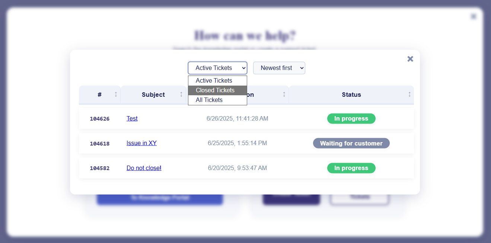
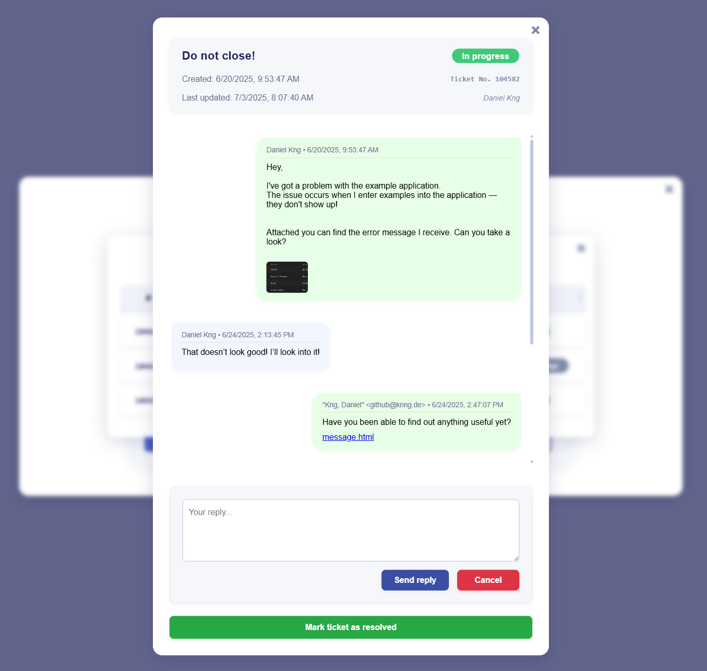
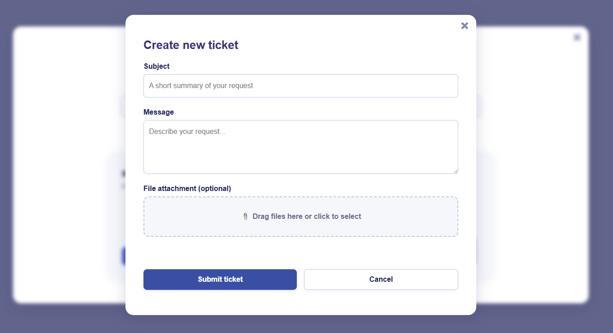

## A modular, internationalized frontend for Zammad-based ticket/helpdesk systems

You can integrate it as a modal pop-up in your existing intranet, for example.

<details>
  <summary>Integration with Contao</summary>

  For Contao, upload all files to the filesystem.  
  Place the contents of `nf_gui.html` in a new article and adjust the paths accordingly.  
  Be sure to remove `<meta charset="utf-8">` from the top of the HTML, as Contao can’t handle it.  

  That’s it! The button will appear wherever you place it, and on click, the background will blur and the modal will pop up.
</details>

<details>
  <summary>Other CMS systems</summary>

  You probably know what you're doing.  
  I haven’t had the chance to test it in other frontends.  
  Be sure to create an issue if problems arise.
</details>

## ⚠️ Important: Configuration Required


**Before using this project, open `src/js/nf-config.js` and read it carefully from top to bottom.**

All user-facing strings, API endpoints, email filters, and system settings are configured there. 

You must review and adjust this file for your environment and localization needs.

Be sure to enable **BASIC-AUTH** in *Zammad* as well!

---

## Features
- Modular JavaScript and CSS
- Fully internationalized (all user-facing strings in config)
- Accessible and responsive UI
- Drag & Drop file uploads for ticket attachments
- Responsive design for all devices
- Internal gallery view for attachments
- Dynamic templates for UI rendering
- Easy to adapt for other helpdesk backends

## Technical Features
- **Persistent Caching**: Ticket-related API responses (tickets, details, search results) are cached using a custom `NFCache` class with localStorage persistence and TTL, for performance and offline resilience. No login or sensitive data is cached.
- **Debounced Search**: Search input uses a debounced function to minimize API calls and improve responsiveness during fast typing.
- **Retry Mechanism**: All API calls use a robust retry wrapper with exponential backoff, configurable via `nf-config.js`.
- **Performance Monitoring**: Built-in performance measurement using the browser's Performance API and a custom `NFPerformance` class.
- **Structured Logging**: Advanced logger with configurable log levels (`debug`, `info`, `warn`, `error`) for easier debugging and monitoring (`nf-config.js`).
- **Input & File Validation**: Comprehensive validation for user input and file uploads, including size and MIME type checks.
- **Error Handling**: Centralized error handling with user-friendly messages and structured error classes.
- **Internationalization Support**: All user-facing strings and labels are centralized in `nf-config.js` for easy localization and language extension.
- **Modular Architecture**: All logic is split into focused modules (API, cache, DOM, events, helpers, search, etc.) for maintainability and extensibility.

## Folder Structure
```
zammad-modal/
├── public/                # Static assets (images, favicon, etc.)
│   └── img/
├── src/                   # All source code
│   ├── css/               # All CSS files (with subfolders: base, components, layout, modules)
│   ├── js/                # All JS files (modularized)
│   └── html/              # HTML templates (e.g., nf_gui.html)
├── README.md
├── LICENSE
├── .gitignore
```

## Screenshots
<table align="center">
  <tr>
    <td></td>
    <td></td>
  </tr>
  <tr>
    <td></td>
    <td></td>
  </tr>
  <tr>
    <td></td>
    <td></td>
  </tr>
</table>

## Setup
1. Clone the repository.
2. Open `src/html/nf_gui.html` in your browser or integrate into your web project.
3. **Carefully review and adjust `src/js/nf-config.js` for your API endpoints, organization, and localization.**
4. Place your images in `public/img/` and update paths in config if needed.

## Usage
- All UI and logic is modular and can be extended.
- To add a new language, duplicate and translate the `labels` in `nf-config.js`.
- For custom backend integration, adapt the API calls in `src/js/nf-api.js`.

## Contributing
Pull requests and issues are welcome! Please follow the code style and add tests where possible.

## License
See [LICENSE](LICENSE) for details.
