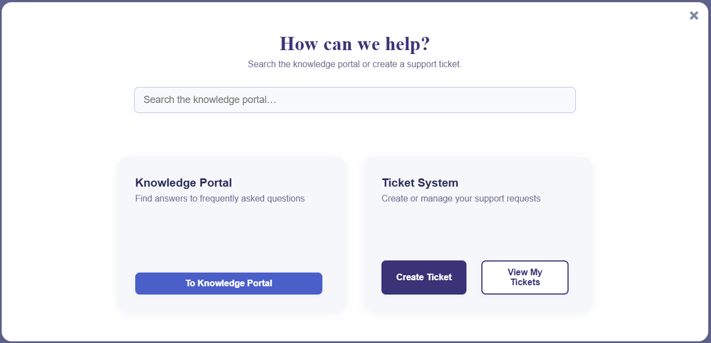
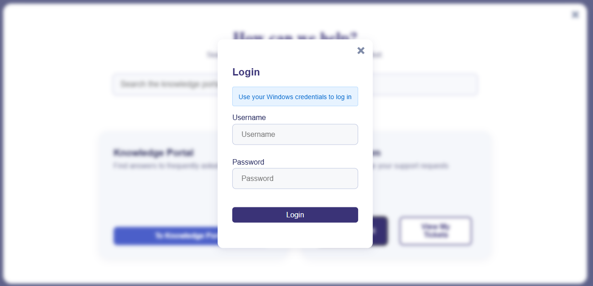

# Unofficial Zammad Ticket Portal


A modular, internationalized frontend for Zammad-based ticket systems that provides a modern user interface for creating and managing support tickets.

> **Note:** This is an unofficial community project, not affiliated with or endorsed by the Zammad Foundation.

---

## Screenshots

<table>
  <tr>
    <td></td>
    <td></td>
  </tr>
  <tr>
    <td></td>
    <td></td>
  </tr>
  <tr>
    <td></td>
    <td></td>
  </tr>
</table>

---

## Overview

This project provides a clean, modal-based interface for Zammad ticket systems that can be easily integrated into existing websites or intranets. It replaces the default Zammad interface with a more user-friendly experience while maintaining full functionality.

**Key Benefits:**
- Modern, responsive design that works on all devices
- Easy integration into existing websites via modal overlay
- Multi-language support (English/German, easily extensible)
- Smart caching for better performance
- File upload with drag-and-drop support

### Professional Project Structure

This repository follows GitHub best practices with comprehensive documentation and templates:

- **[CONTRIBUTING.md](CONTRIBUTING.md)** - Detailed contribution guidelines and development setup
- **[SECURITY.md](SECURITY.md)** - Security policy and vulnerability reporting process
- **[LICENSE.md](LICENSE.md)** - Creative Commons Attribution-NonCommercial-ShareAlike 4.0 License
- **Issue Templates** - Standardized bug reports and feature requests in `.github/ISSUE_TEMPLATE/`
- **Comprehensive README** - Complete setup instructions and technical documentation

### Important: Module Requirements

**This project uses ES6 modules and requires a web server** - it cannot be opened directly by double-clicking the HTML file.

> **Need the legacy version?** Check the [`legacy`](https://github.com/DanielKng/zd-ticket-portal/tree/legacy) branch for a version that opens directly in browsers. Same functionality, but this modern version provides cleaner, more maintainable code.

To run the project locally for testing:

**Option 1: Using npx serve (Recommended)**
```powershell
# Navigate to the project root directory
cd "C:\path\to\ticket_frontend"

# Start a local web server
npx serve .

# Open http://localhost:3000/src/html/nf_gui.html in your browser
```

**Option 2: Deploy to your web server**
Since you'll be integrating this into your website anyway, you can upload the files directly to your web server and test there.

**Why this is required:** Modern ES6 modules have security restrictions that prevent them from loading via the `file://` protocol. A proper HTTP server is required.

---

## Recent Updates

### Language System Modernization
*July 14, 2025*

- Migrated to JSON-based language management with separated categories
- Added event-driven initialization for proper timing
- Improved date localization with proper locale detection
- Centralized language configuration in `nf-config.js`
- Enhanced event system with consolidated keyboard accessibility handling

---

## Quick Setup

### Integration with Contao CMS

1. Upload all files to your server
2. Place the contents of `src/html/nf_gui.html` in a new Contao article
3. Adjust file paths to match your server structure
4. Remove `<meta charset="utf-8">` for Contao compatibility
5. **Important:** Must be served via HTTP - ES modules require a web server

### Other CMS Systems

The portal works as a self-contained modal that can be embedded in any modern web environment. Simply include the HTML file and adjust the JavaScript paths.

**Remember:** Due to ES6 module requirements, files must be served from a web server (not opened directly in browser).

---

## Configuration

**Important:** Before using this project, review `src/js/nf-config.js` carefully.

This file controls:
- **API Endpoints** - Your Zammad server URLs and authentication
- **Language Settings** - Supported languages and file paths
- **Cache Strategy** - TTL values for optimal performance
- **Debug Options** - Logging for development and troubleshooting

**Requirements:** Ensure BASIC-AUTH is enabled in your Zammad instance.

---

## Features

### User Features
- User login via Zammad API
- View all tickets (open and closed)
- Create new tickets with file attachments
- Reply to existing tickets in messenger-style threads
- Image gallery for viewing attachments
- Knowledge base search integration
- Self-service ticket closure
- Responsive design for mobile and desktop

### Technical Features
- **ES Module Architecture** - Modern JavaScript with clean imports/exports
- **Smart Caching System** - Different cache strategies based on content age
- **Multi-language Support** - JSON-based language files with dynamic loading
- **Event-Driven UI** - Proper initialization timing and error handling
- **Advanced Error Handling** - Retry mechanisms and user-friendly messages
- **Performance Monitoring** - Built-in measurement and optimization
- **Accessibility Support** - Keyboard navigation and screen reader compatibility

---

## Technical Architecture

### Language Management

The modern language system uses JSON files organized by category:

```
src/lang/
├── en/
│   ├── ui.json         # Interface labels
│   ├── aria.json       # Accessibility text
│   ├── system.json     # Status messages
│   ├── messages.json   # User notifications
│   └── utils.json      # Utility text
└── de/
    └── (same structure)
```

Configuration in `nf-config.js`:
```javascript
language: {
    default: 'en',
    current: 'en',
    basePath: '../lang',
    supported: {
        en: { locale: 'en-US', label: 'English' },
        de: { locale: 'de-DE', label: 'Deutsch' }
    }
}
```

### Caching Strategy

Intelligent caching with content-aware TTL values:

```javascript
cache: {
    searchResultsTTL: 2 * 60 * 1000,                    // 2 minutes
    currentYearActiveTicketListTTL: 15 * 60 * 1000,     // 15 minutes
    currentYearClosedTicketListTTL: 4 * 60 * 60 * 1000, // 4 hours
    archivedTicketListTTL: 30 * 24 * 60 * 60 * 1000     // 30 days
}
```

**Cache Behavior:**
- Active tickets: Short TTL with manual refresh option
- Closed tickets: Medium TTL (may receive updates)
- Archived tickets: Long TTL (stable content)
- Search results: Brief TTL with cross-session persistence

---

## Project Structure

```
ticket_frontend/
├── .github/
│   └── ISSUE_TEMPLATE/         # Bug report and feature request templates
│       ├── bug_report.md
│       └── feature_request.md
├── public/
│   └── img/                    # Screenshots and assets
│       └── github/             # Documentation images
├── src/
│   ├── css/                    # Stylesheets
│   │   ├── base/              # Typography, variables, utilities
│   │   ├── components/        # Buttons, forms, modals
│   │   ├── layout/            # Cards, sections
│   │   └── modules/           # Feature-specific styles
│   ├── js/                     # JavaScript modules
│   │   ├── nf-config.js       # Central configuration
│   │   ├── nf-lang.js         # Language management
│   │   └── nf-*.js            # Feature modules
│   ├── lang/                   # Language files
│   │   ├── en/                # English translations
│   │   └── de/                # German translations
│   └── html/
│       └── nf_gui.html        # Main interface
├── CONTRIBUTING.md             # Contribution guidelines
├── LICENSE.md                  # Project license
├── README.md                   # This file
└── SECURITY.md                 # Security policy and reporting
```

---

## Adding New Languages

1. Create new folder: `src/lang/[language-code]/`
2. Copy and translate all JSON files from an existing language
3. Add language configuration to `nf-config.js`
4. Update the current or default language setting

**Language File Categories:**
- **ui.json** - Button labels, headers, form fields
- **aria.json** - Screen reader labels and descriptions
- **system.json** - Status messages, loading text
- **messages.json** - Success/error/warning messages
- **utils.json** - Date formats, validation messages

---

## Debug and Troubleshooting

Enable comprehensive logging in `nf-config.js`:

```javascript
debug: {
    logLevel: 'debug',  // 'debug', 'info', 'warn', or 'error'
    enabled: true       // Master switch
}
```

**Debug Output Includes:**
- Cache hit/miss ratios and TTL details
- API request/response timing
- Search result sources (cache vs. fresh API)
- Authentication status and errors
- Modal state changes and events

**Common Issues:**
- **Module loading errors** - Ensure proper web server setup (not file:// URLs)
- **Cache not working** - Check localStorage availability and TTL configuration
- **Login issues** - Verify BASIC-AUTH is enabled in Zammad
- **Language not loading** - Check file paths and network requests

---

## Development Timeline

**July 14, 2025**
- Modern Language System - Complete migration to JSON-based language management
- Separated Language Files - Organized by category for better maintainability
- Event-Driven Initialization - Proper timing synchronization with language loading
- Configurable Language Paths - All file locations now configurable
- Improved Date Localization - Consistent locale-based formatting
- Enhanced Event System - Consolidated keyboard accessibility handling

**July 9, 2025**
- ES Module Architecture - Refactored all JavaScript to use modern imports/exports
- Centralized Modal System - Unified handling for all popup interactions
- Enhanced UX Design - Improved modal effects and user interactions
- Modern Browser Requirements - Updated for current web standards

**July 2025** *(Cache & Status System Overhaul)*
- Intelligent Cache Architecture - Context-aware caching based on ticket age and status
- Cross-Session Persistence - Search results and ticket details survive browser restarts
- Smart Cache Invalidation - Manual reload with intelligent cache clearing
- Centralized Status System - Unified message handling across all modals
- Enhanced Login Experience - Credential hints and contextual error messages
- Configurable TTL Values - Descriptive cache naming for different content types

**Early 2025** *(Foundation & Core Features)*
- Initial ES6 Module Implementation - Modern JavaScript architecture
- Zammad API Integration - Complete ticket lifecycle management
- Multi-language Support - German and English with extensible framework
- Responsive Modal Design - Background blur and layered modal system
- File Upload System - Drag-and-drop with preview functionality
- Gallery Integration - Image viewing for ticket attachments
- Knowledge Base Search - Integration with Zammad help center
- Accessibility Features - Keyboard navigation and screen reader support

---

## Contributing

We welcome contributions from the community! This project follows GitHub best practices with comprehensive templates and guidelines.

### Getting Started

Please read our [Contributing Guidelines](CONTRIBUTING.md) for detailed information about:
- Development setup and prerequisites
- Code style and conventions
- Testing requirements
- Pull request process

### Reporting Issues

- **Bug Reports**: Use our [Bug Report Template](.github/ISSUE_TEMPLATE/bug_report.md)
- **Feature Requests**: Use our [Feature Request Template](.github/ISSUE_TEMPLATE/feature_request.md)

### Security

For security-related issues, please review our [Security Policy](SECURITY.md) and follow the responsible disclosure process outlined there.

### Development Guidelines

When contributing code:

1. Follow the established ES6 module patterns
2. Use the centralized `nfShowStatus()` for user messaging
3. Maintain the language file organization
4. Include appropriate debug logging
5. Test with various ticket states and cache scenarios
6. Update documentation for new features

---

## License

This project is licensed under the Creative Commons Attribution-NonCommercial-ShareAlike 4.0 International License.

See [LICENSE.md](LICENSE.md) for full details or visit: https://creativecommons.org/licenses/by-nc-sa/4.0/legalcode
